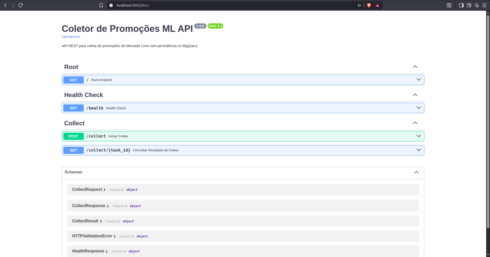

# Desafio Técnico: Coletor de promoções do Mercado Livre

[](https://github.com/phael-exe/prototipo-coletor-promo/actions/workflows/ci.yml)
[](https://github.com/phaelzin/prototipo-coletor-promo/releases)
[](https://www.python.org/downloads/)
[](LICENSE)

## 📋 Visão Geral

Protótipo de um coletor de promoções do Mercado Livre que realiza:
- ✅ **Coleta** de produtos via web scraping com paginação dinâmica
- ✅ **Normalização** dos dados em um modelo consistente (Pydantic)
- ✅ **Persistência** no BigQuery (Google Cloud)
- ✅ **Deduplicação** para evitar registros repetidos

## 🏗️ Arquitetura

```
prototipo-coletor-promo/
├── app/
│   ├── core/
│   │   └── config.py          # Configurações via variáveis de ambiente
│   ├── schemas/
│   │   └── product.py         # Schema Pydantic dos produtos
│   └── services/
│       ├── crawler.py         # Serviço de web scraping
│       └── bigquery.py        # Serviço de persistência BigQuery
├── scripts/
│   ├── crawler_teste.py       # Script de teste da coleta
│   └── bigquery_teste.py      # Script de teste completo (coleta + BigQuery)
├── secrets/                   # Credenciais GCP (não versionado)
├── .env                       # Variáveis de ambiente (não versionado)
├── .env.template              # Template das variáveis necessárias
├── .dockerignore              # Exclusões para build Docker
├── Dockerfile                 # Multi-stage build para Python 3.12
├── docker-compose.yml         # Orquestração de containers
├── requirements.txt           # Dependências Python
├── README.md                  # Este arquivo
├── CHANGELOG.md               # Histórico de mudanças
└── LICENSE                    # Licença MIT
```

### 📦 Estrutura de Containers

```
┌─────────────────────────────────────────────────┐
│         docker-compose.yml                      │
│  ┌───────────────────────────────────────────┐  │
│  │  Service: collector                       │  │
│  │  ┌─────────────────────────────────────┐  │  │
│  │  │ Dockerfile (Multi-stage)            │  │  │
│  │  │ • Stage 1 (Builder): gcc + deps     │  │  │
│  │  │ • Stage 2 (Runtime): app only       │  │  │
│  │  │                                     │  │  │
│  │  │ Image: prototipo-coletor-promo      │  │  │
│  │  └─────────────────────────────────────┘  │  │
│  │         ↓                                   │  │
│  │  Volumes:                                   │  │
│  │  • ./secrets → /app/secrets (ro)           │  │
│  │                                             │  │
│  │  Environment:                               │  │
│  │  • .env file (GCP credentials, API keys)   │  │
│  │  • PYTHONUNBUFFERED=1                      │  │
│  │  • GOOGLE_APPLICATION_CREDENTIALS          │  │
│  └───────────────────────────────────────────┘  │
└─────────────────────────────────────────────────┘
```

## 🚀 Como Rodar Localmente

### 1. Clonar e configurar ambiente

```bash
git clone <repo-url>
cd prototipo-coletor-promo

# Criar ambiente virtual
python -m venv .venv
source .venv/bin/activate  # Linux/Mac
# ou: .venv\Scripts\activate  # Windows

# Instalar dependências
pip install -r requirements.txt
```

### 2. Configurar variáveis de ambiente

```bash
cp .env.template .env
# Editar .env com suas configurações
```

Variáveis necessárias:
```env
USER_AGENT="Mozilla/5.0 (X11; Linux x86_64) AppleWebKit/537.36..."
GCP_PROJECT_ID="seu-projeto-gcp"
GCP_DATASET_ID="seu_dataset"
```

### 3. Configurar credenciais GCP

```bash
mkdir secrets
# Copie o arquivo JSON de credenciais do Service Account para:
# secrets/<seu-arquivo>.json
export GOOGLE_APPLICATION_CREDENTIALS="secrets/<seu-arquivo>.json"
```

### 4. Executar coleta completa

```bash
python scripts/bigquery_teste.py
```

---

## 🌐 API REST com FastAPI

A aplicação possui uma API HTTP que permite disparar coletas programaticamente.

### Iniciar a API

```bash
# Via Docker Compose (recomendado)
docker compose up

# Ou localmente com uvicorn
uvicorn app.main:app --reload --host 0.0.0.0 --port 8000
```

A API estará disponível em:
- **Base URL**: http://localhost:8000
- **Docs (Swagger)**: http://localhost:8000/docs
- **ReDoc**: http://localhost:8000/redoc

### Endpoints Disponíveis

#### `GET /` - Root
Retorna informações básicas da API.

```bash
curl http://localhost:8000/
```

#### `GET /health` - Health Check
Verifica status da API e serviços dependentes (BigQuery).

```bash
curl http://localhost:8000/health
```

Resposta:
```json
{
  "status": "healthy",
  "timestamp": "2026-02-10T12:00:00Z",
  "version": "1.0.0",
  "services": {
    "crawler": "healthy",
    "bigquery": "healthy"
  }
}
```

#### `POST /collect` - Iniciar Coleta
Dispara uma coleta assíncrona de produtos.

```bash
curl -X POST http://localhost:8000/collect \
  -H "Content-Type: application/json" \
  -d '{
    "sources": ["monitor gamer 144hz", "ps5"],
    "limit_per_source": 50,
    "max_pages_per_source": 2,
    "delay_between_requests": 1.5,
    "persist_to_bigquery": true
  }'
```

Resposta (HTTP 202):
```json
{
  "task_id": "a1b2c3d4-e5f6-7890-abcd-ef1234567890",
  "execution_id": "a865239e",
  "status": "started",
  "message": "Coleta iniciada com sucesso. Use o task_id para consultar o resultado.",
  "sources": ["monitor gamer 144hz", "ps5"],
  "estimated_time_seconds": 30
}
```

**Parâmetros:**

| Campo | Tipo | Descrição | Padrão | Limites |
|-------|------|-----------|--------|---------|
| `sources` | `List[str]` | Termos de busca | **obrigatório** | min: 1 |
| `limit_per_source` | `int` | Produtos por fonte | `100` | 1-500 |
| `max_pages_per_source` | `int` | Páginas por fonte | `3` | 1-10 |
| `delay_between_requests` | `float` | Delay em segundos | `1.5` | 0.5-5.0 |
| `persist_to_bigquery` | `bool` | Salvar no BigQuery | `true` | - |

#### `GET /collect/{task_id}` - Consultar Resultado
Retorna o resultado de uma coleta usando o `task_id`.

```bash
curl http://localhost:8000/collect/a1b2c3d4-e5f6-7890-abcd-ef1234567890
```

Resposta:
```json
{
  "execution_id": "a865239e",
  "status": "completed",
  "sources_processed": 2,
  "total_products_collected": 100,
  "products_inserted": 95,
  "products_duplicated": 5,
  "started_at": "2026-02-10T12:00:00Z",
  "completed_at": "2026-02-10T12:00:45Z",
  "error_message": null
}
```

**Status possíveis:**
- `completed`: Coleta concluída com sucesso
- `failed`: Coleta falhou (veja `error_message`)

### Exemplos de Uso

**Python com requests:**
```python
import requests
import time

# 1. Inicia coleta
response = requests.post("http://localhost:8000/collect", json={
    "sources": ["monitor gamer", "teclado mecânico"],
    "limit_per_source": 30,
    "persist_to_bigquery": True
})
data = response.json()
task_id = data["task_id"]
print(f"Coleta iniciada: {task_id}")

# 2. Aguarda e consulta resultado
time.sleep(data["estimated_time_seconds"] + 10)
result = requests.get(f"http://localhost:8000/collect/{task_id}").json()
print(f"Produtos coletados: {result['total_products_collected']}")
print(f"Inseridos no BQ: {result['products_inserted']}")
```

**cURL (linha de comando):**
```bash
# Health check
curl http://localhost:8000/health | jq

# Coleta simples
curl -X POST http://localhost:8000/collect \
  -H "Content-Type: application/json" \
  -d '{"sources": ["ps5"], "limit_per_source": 20}' | jq

# Consultar resultado (substitua TASK_ID)
curl http://localhost:8000/collect/TASK_ID | jq
```

#### Documentação Interativa (Swagger UI)

Acesse a documentação automática no Swagger UI:



### Tratamento de Erros

A API retorna erros padronizados:

```json
{
  "error": "HTTPException",
  "message": "Task não encontrada",
  "details": null,
  "timestamp": "2026-02-10T12:00:00Z"
}
```

**Códigos HTTP:**
- `200`: Sucesso
- `202`: Requisição aceita (coleta em andamento)
- `400`: Parâmetros inválidos
- `404`: Recurso não encontrado
- `500`: Erro interno do servidor

---

## 🐳 Como Rodar com Docker

### 1. Build da imagem

```bash
# Build usando docker-compose
docker compose build

# Ou build manual com Docker
docker build -t prototipo-coletor-promo:latest .
```

### 2. Executar com Docker Compose

```bash
# Rodar uma vez e exibir logs
docker compose up

# Rodar em background
docker compose up -d

# Ver logs de execução
docker compose logs -f collector

# Limpar containers e volumes
docker compose down
```

### 3. Executar com Docker direto

```bash
# Sem variáveis de ambiente
docker run --rm \
  -v ./secrets:/app/secrets:ro \
  -v ./.env:/app/.env:ro \
  prototipo-coletor-promo:latest

# Com variáveis de ambiente passadas explicitamente
docker run --rm \
  -v ./secrets:/app/secrets:ro \
  -e GCP_PROJECT_ID="seu-projeto-gcp" \
  -e GCP_DATASET_ID="seu_dataset" \
  -e GOOGLE_APPLICATION_CREDENTIALS="/app/secrets/gcp-credentials.json" \
  prototipo-coletor-promo:latest
```

### ⚠️ Configurar credenciais GCP para Docker

A containerização requer que as credenciais GCP estejam acessíveis. Existem duas abordagens:

**Opção A: Montar arquivo JSON (Desenvolvimento local)**

```bash
# Certifique-se de que as credenciais estão em ./secrets/
ls ./secrets/gcp-credentials.json

# Execute com volume mounted
docker compose up
```

**Opção B: Passar JSON como variável de ambiente (Cloud Run recomendado)**

1. Converta o arquivo JSON para variável de ambiente:
```bash
export GCP_CREDENTIALS_JSON=$(cat secrets/gcp-credentials.json | base64)
```

2. Modifique o `Dockerfile` (stage 2) para suportar:
```dockerfile
# No Dockerfile, após ENV PYTHONUNBUFFERED=1
ARG GCP_CREDENTIALS_JSON
RUN if [ -n "$GCP_CREDENTIALS_JSON" ]; then \
      echo "$GCP_CREDENTIALS_JSON" | base64 -d > /app/secrets/credentials.json && \
      export GOOGLE_APPLICATION_CREDENTIALS=/app/secrets/credentials.json; \
    fi
```

3. Build e run:
```bash
docker build --build-arg GCP_CREDENTIALS_JSON="$GCP_CREDENTIALS_JSON" \
  -t prototipo-coletor-promo:latest .
```

### 🔍 Verificar imagem Docker

```bash
# Ver tamanho da imagem
docker images prototipo-coletor-promo

# Inspecionar layers
docker inspect prototipo-coletor-promo:latest

# Ver logs do container
docker logs <container-id>
```

### 📋 Variáveis de ambiente no Docker

O `docker-compose.yml` carrega automaticamente do arquivo `.env`:

```env
FIRECRAWL_API_KEY="sua-chave-aqui"
USER_AGENT="Mozilla/5.0 (X11; Linux x86_64)..."
GCP_PROJECT_ID="seu-projeto-gcp"
GCP_DATASET_ID="seu_dataset"
GOOGLE_APPLICATION_CREDENTIALS="secrets/gcp-credentials.json"
```

**Nota**: Variáveis são sobrescritas pelo `docker-compose.yml` se conflitarem.

### 🚀 Deploy no Google Cloud Run

```bash
# 1. Configure gcloud CLI
gcloud auth login
gcloud config set project SEU-PROJETO-GCP

# 2. Build e push para Artifact Registry
gcloud builds submit --tag gcr.io/SEU-PROJETO/coletor-promo:latest

# 3. Deploy como Cloud Run Job
gcloud run jobs create coletor-promocoes \
  --image gcr.io/SEU-PROJETO/coletor-promo:latest \
  --region us-central1 \
  --memory 512Mi \
  --cpu 1 \
  --set-env-vars GCP_PROJECT_ID=SEU-PROJETO,GCP_DATASET_ID=seu_dataset \

# 4. Executar job
gcloud run jobs execute coletor-promocoes --region us-central1

# 5. Agendar execução periódica com Cloud Scheduler
gcloud scheduler jobs create app-engine coletor-diario \
  --schedule="0 2 * * *" \
  --http-method=POST \
  --uri=https://SEU-REGION-SEU-PROJETO.cloudfunctions.net/trigger-job \
  --oidc-service-account-email=SEU-EMAIL@iam.gserviceaccount.com
```

---

## 📦 Módulos Implementados

### 🔍 Web Scraping (`app/services/crawler.py`)

Serviço de coleta que:
- Faz requisições HTTP com User-Agent configurável
- Extrai dados do HTML usando BeautifulSoup
- Implementa retry com backoff exponencial (tenacity)
- Suporta **múltiplas fontes** de busca simultâneas
- **Paginação dinâmica** automática

**Métodos principais:**
| Método | Descrição |
|--------|-----------|
| `fetch_from_sources()` | Coleta de múltiplas queries com paginação |
| `fetch_products_paginated()` | Coleta paginada de uma query específica |
| `fetch_products()` | Coleta simples (sem paginação) |

**Campos extraídos:**
| Campo | Descrição |
|-------|-----------|
| `marketplace` | Identificador do marketplace (`mercado_livre`) |
| `item_id` | ID único do produto (ex: `MLB12345678`) |
| `title` | Título do produto |
| `price` | Preço atual |
| `original_price` | Preço original (se houver desconto) |
| `discount_percent` | Percentual de desconto calculado |
| `seller` | Nome do vendedor |
| `url` | Link direto para o produto |
| `image_url` | URL da imagem principal |
| `source` | Query que gerou o item |
| `dedupe_key` | Chave única para deduplicação |
| `execution_id` | ID único da execução |
| `collected_at` | Timestamp da coleta |

---

### 🗄️ BigQuery (`app/services/bigquery.py`)

Serviço de persistência que:
- Cria tabela automaticamente se não existir
- Insere dados via **LOAD JOB** (compatível com free tier)
- Implementa **deduplicação** antes da inserção
- Fornece estatísticas da tabela

**Métodos principais:**
| Método | Descrição |
|--------|-----------|
| `insert_products()` | Insere produtos com deduplicação |
| `ensure_table_exists()` | Garante que a tabela existe |
| `get_stats()` | Retorna estatísticas da tabela |
| `get_recent_products()` | Busca produtos recentes |

---

## 🔑 Estratégia de Deduplicação

A deduplicação é implementada usando a estratégia de **verificação pré-inserção** com `dedupe_key`.

### Composição da `dedupe_key`

```
dedupe_key = f"{marketplace}_{item_id}_{price}"
```

Exemplo: `mercado_livre_MLB1234567_1299.90`

### Fluxo de Deduplicação

```
┌─────────────────┐
│  Produtos       │
│  coletados      │
└────────┬────────┘
         │
         ▼
┌─────────────────────────────────────┐
│  1. Extrai dedupe_keys dos produtos │
└────────┬────────────────────────────┘
         │
         ▼
┌─────────────────────────────────────┐
│  2. Consulta BigQuery:              │
│     SELECT DISTINCT dedupe_key      │
│     FROM promotions                 │
│     WHERE dedupe_key IN (...)       │
└────────┬────────────────────────────┘
         │
         ▼
┌─────────────────────────────────────┐
│  3. Filtra produtos novos           │
│     (dedupe_key não existe)         │
└────────┬────────────────────────────┘
         │
         ▼
┌─────────────────────────────────────┐
│  4. Insere apenas produtos novos    │
│     via LOAD JOB                    │
└─────────────────────────────────────┘
```

### Por que essa estratégia?

| Vantagem | Descrição |
|----------|-----------|
| **Simplicidade** | Não requer MERGE ou stored procedures |
| **Performance** | Query de verificação é rápida com IN clause |
| **Atomicidade** | Cada inserção é independente |
| **Free Tier** | Funciona sem streaming insert |
| **Idempotência** | Rodar múltiplas vezes não duplica dados |

### Implementação no código

```python
# app/services/bigquery.py

def insert_products(self, products: List[ProductSchema]) -> dict:
    # 1. Busca dedupe_keys existentes
    existing_keys = self._get_existing_dedupe_keys([p.dedupe_key for p in products])
    
    # 2. Filtra apenas produtos novos
    new_products = [p for p in products if p.dedupe_key not in existing_keys]
    duplicates = len(products) - len(new_products)
    
    # 3. Insere apenas os novos
    # ... (LOAD JOB com NDJSON)
```

### Resultado em execução

```
📊 RESULTADO DA INSERÇÃO:
   ✅ Inseridos:   292
   ⏭️  Duplicados:  8
   ❌ Erros:       0
```

---

## 🔧 Configurações (`app/core/config.py`)

| Variável | Descrição | Default |
|----------|-----------|---------|
| `USER_AGENT` | User-Agent para requisições | Chrome Linux |
| `MAX_RETRIES` | Tentativas máximas em caso de falha | 3 |
| `RETRY_MIN_SECONDS` | Tempo mínimo entre retries | 2 |
| `RETRY_MAX_SECONDS` | Tempo máximo entre retries | 10 |
| `GCP_PROJECT_ID` | ID do projeto GCP | - |
| `GCP_DATASET_ID` | ID do dataset BigQuery | - |

---

## 📊 Exemplo de Execução

```bash
$ python scripts/bigquery_teste.py

======================================================================
🗄️  COLETA MULTI-FONTE COM PAGINAÇÃO + BIGQUERY
======================================================================

📋 CONFIGURAÇÃO:
   Fontes: ['monitor gamer 144hz', 'iphone 16', 'ps5']
   Limite por fonte: 100
   Máx. páginas por fonte: 3

📦 monitor gamer 144hz
   Produtos coletados: 100
   Em promoção: 22
   Preço médio: R$ 1383.64

📦 iphone 16
   Produtos coletados: 100
   Em promoção: 45
   Preço médio: R$ 6862.39

📦 ps5
   Produtos coletados: 100
   Em promoção: 17
   Preço médio: R$ 5087.34

🎯 TOTAL COLETADO: 300 produtos

📊 RESULTADO DA INSERÇÃO:
   ✅ Inseridos:   292
   ⏭️  Duplicados:  8
   ❌ Erros:       0

📈 ESTATÍSTICAS DO BIGQUERY:
   Total de produtos:    302
   Itens únicos:         298
   Produtos em promoção: 84
```

---

## 📝 Próximos Passos

- [x] Web scraping com requests + BeautifulSoup
- [x] Normalização completa (todos os campos do desafio)
- [x] Persistência no BigQuery
- [x] Deduplicação por `dedupe_key`
- [x] Coleta multi-fonte com paginação
- [x] Dockerfile e docker-compose
- [x] API FastAPI com endpoints `/health` e `/collect`
- [ ] Deploy no Cloud Run (GCP)
- [ ] Logs estruturados (JSON)
- [ ] Autenticação/Rate limiting na API

---

## 🛠️ Tecnologias Utilizadas

| Tecnologia | Uso |
|------------|-----|
| Python 3.12 | Linguagem principal |
| FastAPI | Framework web assíncrono |
| Uvicorn | Servidor ASGI de alta performance |
| requests | Requisições HTTP |
| BeautifulSoup4 | Parsing de HTML |
| Pydantic | Validação e schemas |
| tenacity | Retry com backoff |
| google-cloud-bigquery | Persistência no BigQuery |
| python-json-logger | Logs estruturados em JSON |
| Docker | Containerização |

---

## 🔐 Logs Estruturados em JSON

O sistema implementa logs estruturados compatíveis com Cloud Logging:

### Configuração

```python
from app.core.logging import configure_logging, get_logger

# Inicializar
configure_logging(level="INFO")
logger = get_logger(__name__)

# Usar com contexto
logger.info("Collection started", extra={
    "task_id": task_id,
    "execution_id": execution_id,
    "sources": sources
})
```

### Campos Padrão em JSON

```json
{
  "timestamp": "2026-02-10T23:16:02.075760+00:00",
  "level": "info",
  "module": "app.routes.collect",
  "message": "Collection task completed",
  "task_id": "31bf705c-4f78-4048-a074-3d46180fe9cf",
  "execution_id": "59a50e2c",
  "duration_seconds": 32.38
}
```

Todos os logs são compatíveis com:
- ✅ GCP Cloud Logging
- ✅ AWS CloudWatch
- ✅ Datadog
- ✅ ELK Stack

Para mais detalhes, veja [LOGGING_GUIDE.md](LOGGING_GUIDE.md)

---

## 🚀 CI/CD: GitHub Actions + Cloud Run

### Fluxo Automático de Deploy

```
GitHub Release
    ↓
Deploy Workflow
    ↓
Build Docker Image
    ↓
Push Artifact Registry
    ↓
Deploy Cloud Run
    ↓
Health Check + Cloud Logging Setup
```

### Setup Inicial

#### 1. Criar Service Account no GCP

```bash
export GCP_PROJECT_ID="seu-projeto-gcp"
export SERVICE_ACCOUNT_NAME="github-actions-deployer"

# Criar Service Account
gcloud iam service-accounts create ${SERVICE_ACCOUNT_NAME} \
  --project=${GCP_PROJECT_ID}

# Adicionar permissões
gcloud projects add-iam-policy-binding ${GCP_PROJECT_ID} \
  --member="serviceAccount:${SERVICE_ACCOUNT_NAME}@${GCP_PROJECT_ID}.iam.gserviceaccount.com" \
  --role="roles/artifactregistry.admin"

gcloud projects add-iam-policy-binding ${GCP_PROJECT_ID} \
  --member="serviceAccount:${SERVICE_ACCOUNT_NAME}@${GCP_PROJECT_ID}.iam.gserviceaccount.com" \
  --role="roles/run.admin"

gcloud projects add-iam-policy-binding ${GCP_PROJECT_ID} \
  --member="serviceAccount:${SERVICE_ACCOUNT_NAME}@${GCP_PROJECT_ID}.iam.gserviceaccount.com" \
  --role="roles/iam.serviceAccountUser"

gcloud projects add-iam-policy-binding ${GCP_PROJECT_ID} \
  --member="serviceAccount:${SERVICE_ACCOUNT_NAME}@${GCP_PROJECT_ID}.iam.gserviceaccount.com" \
  --role="roles/logging.admin"

gcloud projects add-iam-policy-binding ${GCP_PROJECT_ID} \
  --member="serviceAccount:${SERVICE_ACCOUNT_NAME}@${GCP_PROJECT_ID}.iam.gserviceaccount.com" \
  --role="roles/bigquery.admin"
```

#### 2. Criar Artifact Registry

```bash
gcloud artifacts repositories create docker-repo \
  --repository-format=docker \
  --location=us-central1 \
  --project=${GCP_PROJECT_ID}
```

#### 3. Adicionar Secrets no GitHub

```bash
# Gerar chave JSON
gcloud iam service-accounts keys create key.json \
  --iam-account=${SERVICE_ACCOUNT_NAME}@${GCP_PROJECT_ID}.iam.gserviceaccount.com

# Adicionar secrets
gh secret set GCP_PROJECT_ID --body "seu-projeto-gcp"
gh secret set GCP_REGION --body "us-central1"
gh secret set GCP_DATASET_ID --body "promocoes_teste"
gh secret set GCP_SA_KEY --body "$(cat key.json)"
gh secret set GCP_CLOUD_RUN_SA --body "cloud-run-app@seu-projeto-gcp.iam.gserviceaccount.com"

rm key.json
```

### Fazer Deploy

**Opção 1: Release (Automático)**
```bash
git tag v1.3.0
git push origin v1.3.0
```

**Opção 2: Manual (workflow_dispatch)**
```bash
gh workflow run deploy.yml -f environment=staging
```

O workflow fará automaticamente:
- ✅ Build da imagem Docker
- ✅ Push para Artifact Registry
- ✅ Deploy no Cloud Run
- ✅ Health check
- ✅ Configuração de Cloud Logging

---

## 📊 BigQuery: Queries Úteis

### 1. Total de Produtos

```sql
SELECT 
  COUNT(*) as total_products,
  COUNT(DISTINCT dedupe_key) as unique_products,
  COUNT(DISTINCT execution_id) as total_collections,
  ROUND(AVG(price), 2) as avg_price
FROM `{project}.{dataset}.promotions`
```

### 2. Produtos por Fonte

```sql
SELECT 
  source,
  COUNT(*) as total,
  COUNT(DISTINCT dedupe_key) as unique_items,
  ROUND(AVG(price), 2) as avg_price,
  COUNTIF(discount_percent > 0) as on_sale
FROM `{project}.{dataset}.promotions`
GROUP BY source
ORDER BY total DESC
```

### 3. Descontos Mais Altos

```sql
SELECT 
  title,
  source,
  price,
  original_price,
  discount_percent,
  url
FROM `{project}.{dataset}.promotions`
WHERE discount_percent IS NOT NULL
ORDER BY discount_percent DESC
LIMIT 20
```

### 4. Evolução de Coletas por Dia

```sql
SELECT 
  DATE(collected_at) as data,
  COUNT(*) as produtos,
  COUNT(DISTINCT execution_id) as coletas,
  ROUND(AVG(price), 2) as preco_medio
FROM `{project}.{dataset}.promotions`
GROUP BY data
ORDER BY data DESC
```

### 5. Histórico de Preços de um Produto

```sql
SELECT 
  title,
  collected_at,
  price,
  discount_percent,
  LAG(price) OVER (ORDER BY collected_at) as preco_anterior,
  ROUND((price - LAG(price) OVER (ORDER BY collected_at)) / 
        LAG(price) OVER (ORDER BY collected_at) * 100, 2) as variacao_pct
FROM `{project}.{dataset}.promotions`
WHERE LOWER(title) LIKE '%ps5%'
ORDER BY collected_at DESC
```

### 6. Produtos Mais Buscados

```sql
SELECT 
  source,
  COUNT(*) as vezes_encontrado,
  ROUND(AVG(price), 2) as preco_medio,
  COUNTIF(discount_percent > 0) as com_desconto
FROM `{project}.{dataset}.promotions`
GROUP BY source
ORDER BY vezes_encontrado DESC
LIMIT 20
```

**Substitua:**
- `{project}` → Seu GCP Project ID
- `{dataset}` → Seu Dataset BigQuery

Para mais queries, veja [BIGQUERY_QUERIES.md](BIGQUERY_QUERIES.md)

---

## 🔍 Monitoramento

### Cloud Logging

Acesse os logs estruturados:
```
https://console.cloud.google.com/logs/query?project=seu-projeto-gcp
```

**Filtros úteis:**
```
# Todos os logs da aplicação
resource.type="cloud_run_revision"
jsonPayload.module=~"app.*"

# Apenas erros
resource.type="cloud_run_revision"
jsonPayload.level="error"

# Logs de uma task específica
resource.type="cloud_run_revision"
jsonPayload.task_id="sua-task-id"
```

### Cloud Run Dashboard

```
https://console.cloud.google.com/run?project=seu-projeto-gcp
```

Visualize:
- Status das deployments
- Performance metrics
- Erros e logs
- Traffic patterns

### BigQuery

```
https://console.cloud.google.com/bigquery?project=seu-projeto-gcp
```

Analise os dados coletados em tempo real

---

## 📜 Changelog

### v1.2.0 - Logs Estruturados em JSON (2026-02-10)

Release com migração completa para logs estruturados:

- **Logs em JSON**: Estrutura padrão com timestamp, level, module
- **python-json-logger**: Integração com Cloud Logging
- **Contexto completo**: execution_id, task_id em cada log
- **Remoção de prints**: Todos substituídos por logger calls
- **Cloud Logging ready**: Pronto para GCP

Para detalhes, veja [CHANGELOG.md](CHANGELOG.md)

### v1.1.0 - API REST com FastAPI (2026-02-10)

Release focada em transformar a aplicação em serviço web:

- **API REST**: 4 endpoints (GET /, GET /health, POST /collect, GET /collect/{task_id})
- **Documentação automática**: Swagger UI + ReDoc
- **Coleta assíncrona**: BackgroundTasks do FastAPI
- **Schemas validados**: Pydantic models para requests/responses
- **Tratamento de erros**: JSON standardizado

### v1.0.0 - Primeira Release (2026-02-09) 🎉

MVP completo do coletor de promoções com todas as funcionalidades core:

- **Coleta Multi-Fonte**: suporte a múltiplas queries simultâneas com paginação dinâmica
- **Persistência BigQuery**: integração completa com Google BigQuery via LOAD JOB
- **Deduplicação**: verificação pré-inserção com `dedupe_key` (marketplace + item_id + price)
- **Normalização**: schema Pydantic com todos os campos do desafio
- **CI/CD**: GitHub Actions para lint, validação e releases automáticas

📊 **Métricas de teste**: 300 produtos coletados, 292 inseridos, 8 duplicatas ignoradas

---

## 📜 Versionamento

Este projeto usa [Semantic Versioning](https://semver.org/). 
Veja o [CHANGELOG.md](CHANGELOG.md) para histórico completo de mudanças.

### Como criar uma release

```bash
# Commit suas mudanças
git add .
git commit -m "feat: nova funcionalidade"

# Crie e push a tag
git tag -a v1.1.0 -m "Release v1.1.0 - Nova Feature"
git push origin v1.1.0
```

O GitHub Actions criará automaticamente a release com os artefatos.

---

> Desenvolvido para o processo seletivo PromoZone